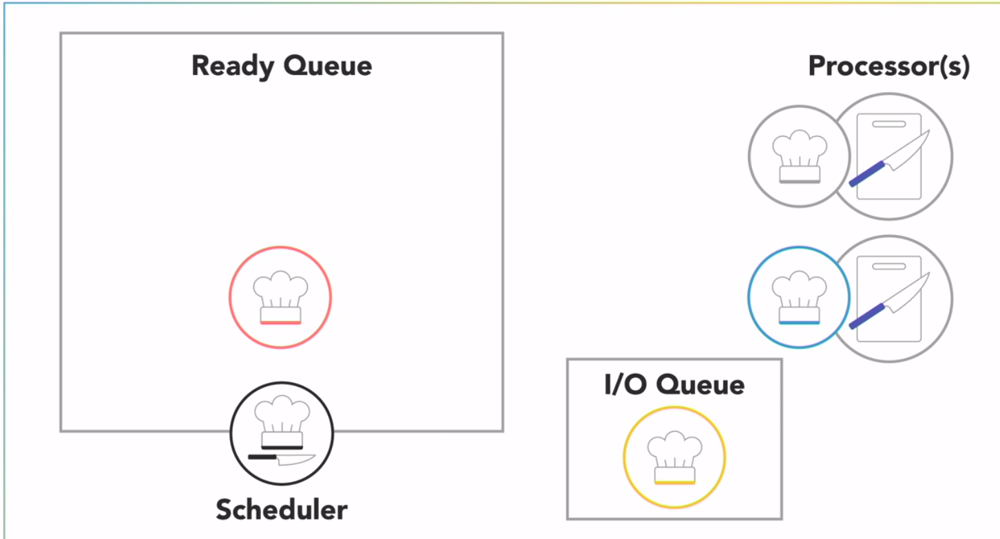
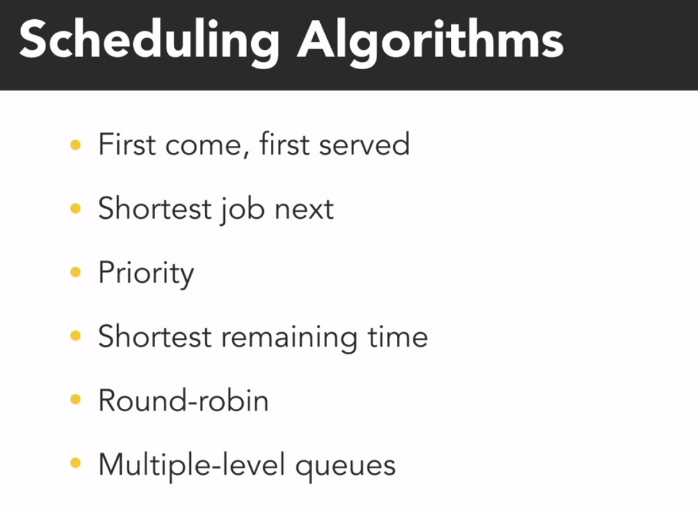

# Scheduling

_Threads don't just execute whenever they want to. A computer might have hundreds of processes with thousands of threads that all want their turn to run on just a handful of processors._ 

_The OS includes a scheduler that controls when different threads and processes get their turn to execute on the CPU. The scheduler makes it possible for multiple programs to run concurrently on a single processor._


_When a process is created and ready to run, it gets loaded into memory and placed in the ready **queue**._


## A few real-world exampels

If there are multiple processors, then the OS will schedule processes to run on each of them to make the most use of the additional resources. 

The lifecycle of a process is as follows:

1.  The scheduler cycles through the ready processes so they get a chance to execute on the processor. 
2.  A process will run until it finishes
3.  Then a scheduler will assign another process to execute on that processor.

In case processes are waiting for I/O, they will be placed in the **blocked** **I/O**" queue.





## Context switch 

_Storing the state of a process and restoring it later is called a context switch._

_Loading the state for the **new** process or thread to run_

_It is managed by the OS_

There are a few algorithms that the OS uses to decide which process to run next.




```python
import threading
import time

chopping = True

def vegetable_chopper():
    name = threading.current_thread().getName()
    vegetable_count = 0
    while chopping:
        print(name, 'chopped a vegetable!')
        vegetable_count += 1
    print(name, 'chopped', vegetable_count, 'vegetables.')

if __name__ == '__main__':
    threading.Thread(target=vegetable_chopper, name='Barron').start()
    threading.Thread(target=vegetable_chopper, name='Olivia').start()

    time.sleep(5)    # chop vegetables for 1 second
    chopping = False # stop both threads from chopping
```

### Output

```bash
Olivia chopped a vegetable!
Olivia chopped a vegetable! 
Barron chopped a vegetable!
Barron chopped a vegetable!
Olivia chopped 425069 vegetables.
chopped a vegetable!
Barron chopped 435820 vegetables.
```

Not always data processing with threads will have the same results due to the scheduler it can be locked 

