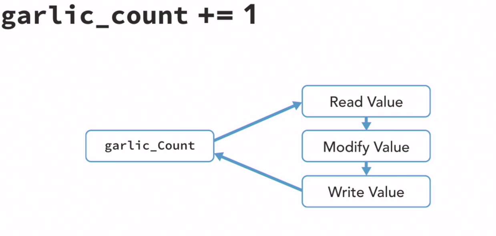

# Data Race

_Data races are a common problem that can occur when two or more threads are concurrently accessing the same location in memory and at least one of those threads is writing to that location to modify its value._

https://www.linkedin.com/learning/python-parallel-and-concurrent-programming-part-1/data-race?autoplay=true&resume=false&u=106534538

Python code example

```python

import threading

garlic_count = 0

def shopper():
    global garlic_count
    for i in range(10_000_000):
        garlic_count += 1

if __name__ == '__main__':
    barron = threading.Thread(target=shopper)
    olivia = threading.Thread(target=shopper)
    barron.start()
    olivia.start()
    barron.join()
    olivia.join()
    print('We should buy', garlic_count, 'garlic.')
```

Output

```bash
We should buy 13290887 garlic.

The correct answer is 20 milion garlic
```

In this case we can see, that during the execution of the program, the value of the variable `garlic_count` is not equal to 20 million, but to 13 million.

The normal workflow for it 



It is caused due to the fact that the variable `garlic_count` is accessed by two threads at the same time, and the value of the variable is changed by both threads.
Threads intentionally change the value of the variable at the same time so that it produces an incorrect result

___! PAY ATTENTION WHENEVER TWO OR MORE FRIENDS ACCESS THE SAME RESOURSE !___


## Mutual Exclusion

**Critical Section** - is a code segment that accesses shared data and shared resource.

_NOTE #1_:  _It may not operate correctly if two or more threads are executing the critical section at the same time._

_NOTE #2_: _It shouldn't be executed by more than one thread or process at a time._

Real World Example

We have a shopping list and there is 3 steps to complete it:
1. Read
2. Modify
3. Write


_Those three steps is a critical section_. _And they need to be executed as __uninterrupted__ action! So we don't accidentally overwrite it_ 


## Mutex (Lock)

_Mechanism to implement mutual exclusion in a concurrent program._

_Only one thread or process can posses at a time._

_Limits the number of threads that can access a critical section at the same time. (forcing them to wait until the critical section is free)_ 

**Algorithm**:
1. Thread tries to acquire the lock
2. If the lock is free, the thread acquires it and continues
3. If the lock is already acquired by another thread, the thread waits until the lock is released
4. When the thread is done with the critical section, it releases the lock
5. If the lock is not acquired by any thread, the next thread in the queue acquires the lock and continues

**TIP: Keep the critical section as small as possible**

Python code example

```python
""" Two shoppers adding items to a shared notepad """
import threading
import time

garlic_count = 0
pencil = threading.Lock()

def shopper():
    global garlic_count
    for i in range(100):
        print(threading.current_thread().getName(), 'is thinking.')
        time.sleep(0.5)
        pencil.acquire()
        garlic_count += 1
        pencil.release()

if __name__ == '__main__':
    barron = threading.Thread(target=shopper)
    olivia = threading.Thread(target=shopper)
    barron.start()
    olivia.start()
    barron.join()
    olivia.join()
    print('We should buy', garlic_count, 'garlic.')
```

Output

```bash
Thread-1 is thinking.
Thread-2 is thinking.
Thread-1 is thinking.
Thread-2 is thinking.
Thread-1 is thinking.
We should buy 200 garlic.
```


